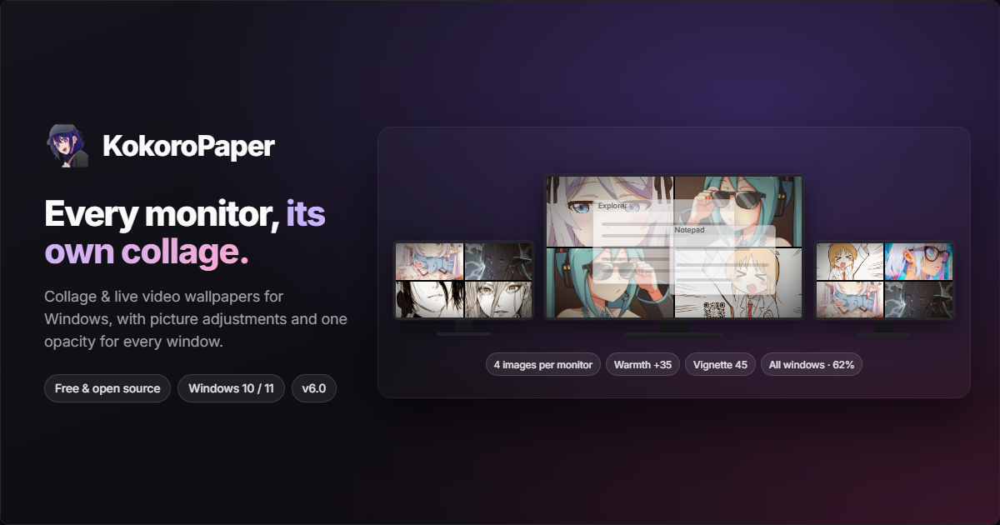

# KokoroPaper

> Collage and live video wallpapers for every monitor you own, with picture adjustments and one opacity for every window. Free, open-source, and offline. For Windows 10 and 11.

*KokoroPaper was called **WallpaperChanger** until v6.0. Same app, same settings, new name. Updating from an older version replaces the old install rather than adding a second one.*

[](https://tauri.app)
[](https://react.dev)
[](https://rust-lang.org)
[](https://microsoft.com)
[](https://opensource.org/license/mit)
[](https://wallpaper.astrofocus.app/)

---



## Why KokoroPaper?

Most wallpaper utilities are either simple slideshows that cannot handle more than one display, or heavy tools locked behind subscriptions and ads. **KokoroPaper** gives you the premium features for free: open-source, offline, and with no account.

| Feature | Other Wallpaper Utilities | KokoroPaper |
| :--- | :--- | :--- |
| **Multi-Monitor Layouts** | One image stretched across screens, or forced per screen | **Collage Mode**: a grid of 1–8 images per monitor |
| **Picture Tuning** | Edit every image by hand, or live with it | **Adjustments**: brightness, contrast, saturation, warmth, blur, and vignette on the whole collage |
| **Live Wallpapers** | Restricted, resource-heavy, or paid | **Video Wallpaper**: stable, aspect-correct playback via `libmpv` |
| **Window Transparency** | One window at a time, lost when it closes | **All Windows**: one opacity for every window, including ones opened later and after a restart |
| **Transitions** | Instant, jarring cuts | **Native Fade**: uses the built-in Windows wallpaper transition |
| **System Footprint** | Takes up the taskbar, collects telemetry, shows ads, needs an account | **Zero Bloat**: runs quietly in the system tray, no telemetry |
| **Language Support** | English only | **Multi-Language**: English, Português, and Japanese UI |
| **Automation & Scripts** | Configured only through the GUI | **CLI Console**: apply wallpapers, play videos, and run watch cycles |

---

## Architecture

The desktop app is a single native process, in two halves.

```
+------------------------------------------+
|  desktop/  -  Tauri 2 shell (Rust)        |
|  React 19 + shadcn/ui + Tailwind 4        |
|  Owns: window, tray, global hotkeys       |
+---------------------+--------------------+
                      |  in-process dispatch
+---------------------v--------------------+
|  crates/wallpaper-core/  -  engine        |
|  Rust 2021, no Tauri dependency           |
|  Owns: everything touching Win32          |
+------------------------------------------+
```

**Why one process.** It used to be two: the engine was Python, frozen with PyInstaller,
and spoke JSON-RPC over a pipe. v6.0 replaced it with a native crate one piece at a time,
behind a seam that kept the app working at every step. The split had bought a crash
boundary the app never actually used: there was no restart logic, so a dead engine left
a window that could only be closed. It also cost a 145 MB sidecar, a second toolchain,
and a teardown that ran in the wrong process.

The engine deliberately has **no Tauri dependency**, so it stays testable without a
window; the shell injects the few things that need one. The webview still cannot spawn
anything, and can reach the engine only through the engine's method allowlist.

| Layer | Technology |
| :--- | :--- |
| **Shell & window** | Tauri 2 (Rust 2021), WebView2 |
| **Interface** | React 19, TypeScript, Vite 8 |
| **Components** | shadcn/ui on Base UI, Tailwind CSS 4, lucide icons |
| **Native integration** | `tauri-plugin-global-shortcut`, `-autostart`, `-dialog`, `-notification`, `-opener`, `-log` |
| **Engine** | Rust, `image` + `fast_image_resize`, `windows`, libmpv via runtime FFI |
| **Packaging** | Tauri bundler (NSIS), with libmpv as a bundled resource |


---

## Features

- **Collage Grid**: automatic grid layouts of 1 to 8 images per monitor.
- **Picture Adjustments** *(new in 6.0)*: six sliders for brightness, contrast, saturation, warmth, blur, and vignette. They apply to the whole collage after the colour effect, and the preview shows them before anything is applied. Blur and vignette are worked out for each monitor separately, so they never bleed across a seam or turn three screens into one oval. Brightness, contrast, and saturation also apply to the video wallpaper, live.
- **One Opacity for Every Window** *(new in 6.0)*: fade every window to the same opacity: the ones already open, and every one opened afterwards. The setting comes back after a restart, and quitting the app returns each window to the opacity it had before.
- **Reads What It Can, Names What It Can't**: reads `jpg`, `jpeg`, `png`, `bmp`, and `webp`, deciding the format from the file's *contents* rather than its extension, because roughly one picture in ten is named for a format it is not. Pictures it cannot decode (HEIC, AVIF, camera raw) are counted and named under the folder rather than quietly left out, and a single unreadable file costs its own thumbnail and nothing else.
- **Live Preview**: the interface renders the real composited collage before anything touches your desktop, so changes to the effect, fit, and adjustments show up immediately. Monitor outlines are drawn over it, any screen can be zoomed to on its own, the whole thing expands to fill the window, and what you are looking at can be applied as-is.
- **Editable Preview**: before anything is applied, drag one picture in the preview onto another to swap them, or click one to choose a different image.
- **Save & Gallery**: keep any collage as an image file, either the whole desktop or a single monitor's share of it, composed at full resolution. The Gallery screen lists every one you have saved, ready to view again or put straight back on the desktop.
- **Video Wallpaper**: plays `.mp4`, `.mkv`, `.webm`, `.mov`, and other common formats behind your desktop icons using `libmpv`, with optional audio, looping, and playlist controls.
- **Stable Video Rendering**: presents with D3D11 and decodes in software, which avoids fragile hardware-decoder surfaces while keeping GPU composition smooth.
- **Native Fade Transitions**: lets Windows apply its built-in wallpaper fade, with no custom animation loop or desktop flicker.
- **Action Bar**: a persistent bar at the bottom of every screen for apply, previous, next, rotation, and video playback.
- **Auto-Rotation**: rotates your backgrounds at a set interval, in random or newest-first order. Newest-first stays quick even in folders of several thousand pictures.
- **Window Transparency**: fade a single window with the slider or a toggle hotkey, or hold a modifier of your choice (`Alt`, `Ctrl`, `Shift`, `Win`) and scroll the wheel to fade the focused window.
- **Global Hotkeys**: nothing is bound out of the box. Assign only the shortcuts you want, from the Hotkeys screen.
- **System Tray**: closing the window hides the app to the notification area, with a right-click menu for the common actions, including starting and stopping rotation.
- **Start with Windows**: on by default from the first launch. It is a setting inside the app, so you can turn it off without reinstalling. When Windows starts the app at boot, it goes straight to the tray; **Start minimized** does the same when you open the app yourself.
- **Resumes Where You Left Off**: rotation and the video wallpaper are remembered as they are switched, and come back on the next launch.
- **Windows Installer**: an NSIS installer produced by the Tauri bundler and signed, so the app can update itself in place.

---

## Quick Start

### Option A - Installer (recommended)

1. Download the `-setup.exe` from the [GitHub Releases](https://github.com/klysman08/wallpaper-changer-windows/releases) page. After that, the app checks for new releases itself and can install them for you.
2. Run the installer.
3. Point the app at your wallpapers or video folder and press **Apply Now** or **Play video**.

### Option B - From source

```powershell
# 1. Clone the repository
git clone https://github.com/klysman08/wallpaper-changer-windows.git
cd wallpaper-changer-windows

# 2. Run the desktop app (the engine compiles with it)
cd desktop
bun install
bun run tauri dev
```

#### Prerequisites

| Tool | Minimum Version | Reference |
| :--- | :--- | :--- |
| **Windows** | 10 / 11 | - |
| **Rust** | 1.77+ | [rustup.rs](https://rustup.rs) |
| **Bun** | 1.1+ | [bun.sh](https://bun.sh) |
| **WebView2** | Runtime | Preinstalled on Windows 11 |

---

## Detailed Configuration

### 1. Video Wallpapers

Point the app at a folder of background videos. `libmpv` renders each display into the desktop `WorkerW` layer, while the app keeps the playback controls responsive and tears down native resources safely.

- Loop or single playback.
- Optional audio, toggled live without restarting playback.
- Aspect ratio is preserved, so 9:16 vertical clips stay intact on horizontal displays.
- Previous and next controls keep every monitor on the same playlist item.
- Brightness, contrast, and saturation from the Adjustments card apply to the video too.

### 2. Image Effects

Choose a colour style for the collage:

- **Normal**
- **Black & White** (greyscale conversion)
- **Vintage** (sepia styling)
- **HDR** (dynamic contrast enhancement)

### 3. Picture Adjustments

The **Adjustments** card on the Wallpaper screen runs after the effect. Every slider rests at 0, which leaves the picture exactly as it was; double-click a slider's label to put it back at 0, or use **Reset all**.

| Slider | Range | What it does |
| :--- | :--- | :--- |
| Brightness | -100 to 100 | Darkens toward black or brightens |
| Contrast | -100 to 100 | Flattens toward grey or deepens |
| Saturation | -100 to 100 | Drains toward greyscale or intensifies colour |
| Warmth | -100 to 100 | Shifts cool (blue) or warm (orange) |
| Blur | 0 to 100 | Softens the picture, for a calmer desktop behind your icons |
| Vignette | 0 to 100 | Darkens each monitor's corners |

Blur and vignette are sized as a share of each monitor, so the preview looks the same as the desktop. They apply to still wallpapers only, while the other sliders apply to the video wallpaper as well.

### 4. Window Transparency

- **All windows**: turn it on from the Transparency screen and pick one opacity (8% to 100%). Every window fades to it, including ones opened later. While it is on, it overrides the opacity saved for individual apps; turn it off and each window goes back to what it had. It returns after a restart as long as **Start with Windows** is on. Windows running as administrator (Task Manager, elevated terminals) cannot be faded by a normal app, so they are left alone.
- **One window**: adjust the alpha (20 to 255) of any open window with the slider.
- **Scroll to adjust**: turn it on from the Transparency screen, pick `Alt`, `Ctrl`, `Shift`, or `Win`, then hold that key and turn the wheel to fade the focused window. It is off by default, because it installs a system-wide mouse hook.
- Per-app opacity is remembered per executable, not per window, so it survives closing and reopening the application. It is saved in `transparency.json` under `%APPDATA%\WallpaperChanger\`.

### 5. Image Formats

KokoroPaper reads `jpg`, `jpeg`, `png`, `bmp`, and `webp`. Two details matter more than the list:

- **The format is decided by content, not by the extension.** In one real folder of 4948 wallpapers, 470 files (9.5%) were named for a format they were not, in every direction: JPEGs called `.webp`, WebPs called `.jpeg` and `.png`, PNGs called `.jpeg`. An app that trusts the extension fails on about a third of the collages drawn from a folder like that.
- **What cannot be read is reported, not hidden.** HEIC, AVIF, JXL, TIFF, GIF, PSD, and camera raw have no decoder here. HEIC needs libheif and AVIF needs dav1d, both C libraries, and neither is worth carrying next to a 112 MB libmpv. The folder line says how many files were skipped and which formats they were, so a folder that shows fewer pictures than Explorer does explains itself.

A file that will not open costs its own thumbnail and nothing else. The reason is written to the app log and returned to the interface, so the file can be named rather than just missing.

---

## Global Hotkeys

**No shortcut is bound after installation.** On Windows, a global hotkey belongs to a single process, so claiming a dozen combinations on first run would silently take them from applications you already use. Assign the ones you want from the Hotkeys screen; the clear button unbinds one again.

Bindings use the syntax `ctrl+alt+right`, `alt+a`, `ctrl+alt+.`. The suggestions below are what earlier versions shipped with, kept here as a starting point.

| Action | Suggested Shortcut |
| :--- | :--- |
| Next wallpaper | `Ctrl+Alt+Right` |
| Previous wallpaper | `Ctrl+Alt+Left` |
| Stop / start rotation | `Ctrl+Alt+S` |
| Default wallpaper | `Ctrl+Alt+D` |
| Toggle window | `Ctrl+Alt+W` |
| Toggle active window opacity | `Alt+A` |
| Effect: normal | `Ctrl+Alt+1` |
| Effect: black & white | `Ctrl+Alt+2` |
| Effect: vintage | `Ctrl+Alt+3` |
| Effect: HDR | `Ctrl+Alt+4` |
| Toggle video wallpaper | `Ctrl+Alt+V` |
| Toggle video sound | `Ctrl+Alt+M` |
| Next video | `Ctrl+Alt+.` |
| Previous video | `Ctrl+Alt+,` |

If a binding fails to register, another application already owns it. The interface reports which ones did not take.

---

## Command Line Interface

The application binary *is* the CLI: give it a subcommand and it runs headless instead
of opening a window. Use it from PowerShell or in scripts:

```powershell
$app = "$env:LOCALAPPDATA\KokoroPaper\KokoroPaper.exe"

# Apply the wallpaper immediately
& $app apply

# Six images per monitor, chosen at random
& $app apply --collage-count 6 --selection random

# Apply with an effect
& $app apply --effect vintage

# Tune the picture: warmer, a little darker, soft corners
& $app apply --warmth 25 --brightness -10 --vignette 40

# Rotate on the configured interval until Ctrl+C
& $app watch

# Play a folder as a video wallpaper until Ctrl+C
& $app video --folder "C:\Videos\live"
```

The adjustment flags (`--brightness`, `--contrast`, `--saturation`, `--warmth`, `--blur`, `--vignette`) take the same ranges as the sliders.

---

## Configuration

User files live outside the installation directory, so the app works correctly when installed under `Program Files`. The folders keep their pre-rename names, so an upgrade finds its settings where it left them:

| Location | Contents |
| :--- | :--- |
| `%APPDATA%\WallpaperChanger\` | `settings.toml`, `state.json`, `transparency.json`, `gallery.json` |
| `%LOCALAPPDATA%\WallpaperChanger\` | Composed wallpaper output, and `saved/` for exported collages |

On first run the app writes a `settings.toml` with the defaults below, comments and all. If an older in-install `config/` directory is present, it is copied across first, so an upgrade keeps its settings; nothing is ever moved or overwritten. Both locations can be redirected with the `WALLPAPER_CHANGER_CONFIG_DIR` and `WALLPAPER_CHANGER_DATA_DIR` environment variables.

```toml
[general]
mode                 = "collage"
selection            = "random"       # random | sequential (newest first)
interval             = 300
collage_count        = 4
collage_same_for_all = false
language             = "en"
start_minimized      = false
check_updates        = true

[paths]
wallpapers_folder = "C:\\Users\\Public\\Pictures"
output_folder     = "output"          # relative paths resolve under %LOCALAPPDATA%
default_wallpaper = ""
saved_folder      = ""                # empty: %LOCALAPPDATA%\WallpaperChanger\saved

[display]
fit_mode   = "fill"                   # fill | fit | stretch | center | span
effect     = "normal"                 # normal | bw | vintage | hdr
# Picture adjustments, applied after the effect. 0 leaves the picture alone.
brightness = 0                        # -100 .. 100
contrast   = 0                        # -100 .. 100
saturation = 0                        # -100 .. 100
warmth     = 0                        # -100 (cool) .. 100 (warm)
blur       = 0                        # 0 .. 100
vignette   = 0                        # 0 .. 100

# Empty means "not registered". Assign shortcuts from the Hotkeys screen.
[hotkeys]
next_wallpaper      = ""
prev_wallpaper      = ""
stop_watch          = ""
default_wallpaper   = ""
toggle_transparency = ""
toggle_window       = ""
# Not shortcuts: hold scroll_modifier and turn the wheel to fade the focused
# window. Off by default because it installs a system-wide mouse hook.
scroll_enabled      = false
scroll_modifier     = "alt"           # alt | ctrl | shift | win
effect_normal       = ""
effect_bw           = ""
effect_vintage      = ""
effect_hdr          = ""
toggle_video        = ""
toggle_video_sound  = ""
next_video          = ""
prev_video          = ""

[transparency]
# One opacity for every window, open now or opened later. Overrides per-app
# values while on. Off by default because it installs a system-wide window hook.
all_windows       = false
all_windows_alpha = 204               # 20 .. 255 (255 is fully opaque)

[video]
enabled = false
folder  = "C:/Users/YourName/Videos/Wallpapers"
loop    = false
sound   = true
```

---

## Build Pipelines

The Tauri bundler produces the installers, so there is no separate Inno Setup step and nothing is written to the registry at install time.

```powershell
# Full release: app, signed installer, and the updater manifest
.\scripts\build_app.ps1

# Debug binary, no installers (fast smoke test)
.\scripts\build_app.ps1 -NoBundle
```

A bundled build is signed for the in-app updater, so the minisign key must be in the
environment first. The script checks for it and stops before the long compile rather than
after it. `libmpv-2.dll` ships as a Tauri resource beside the executable. Installers land
in `desktop/src-tauri/target/release/bundle/`, and `dist/release/` collects exactly what
a GitHub release needs.

### Tests and linting

```powershell
cd desktop/src-tauri
cargo test --workspace              # engine, shell, golden images, protocol corpus
cargo clippy --workspace --all-targets
cargo fmt --all -- --check
cargo check -p tauri-native         # the shipping build, on its own

cd ../..; cd desktop
bun run build                       # type-check and build the interface
```

Tests that would take over the screen (applying a wallpaper, fading a window, embedding
anything in the desktop layer) are `#[ignore]`d and run only when asked for:

```powershell
cargo test -p wallpaper-core --test desktop_layer -- --ignored --nocapture
cargo test -p wallpaper-core --test window_opacity -- --ignored --nocapture
```

---

## Project Structure

```
wallpaper-changer/
├── assets/icon/wpaper-logo.png   # Icon source
├── docs/                         # The project website (GitHub Pages)
├── libmpv/libmpv-2.dll           # Not committed; bundled as a Tauri resource
├── openspec/                     # Change proposals, designs, and task records
├── scripts/
│   ├── build_app.ps1             # App, signed installer, updater manifest
│   └── make_icon.py              # Logo to icon source (standalone, needs Pillow)
├── tests/
│   ├── conformance/              # Protocol corpus, language-neutral
│   └── differential/golden/      # Composition pinned against Pillow's output
└── desktop/                      # Tauri 2 desktop application
    ├── src/
    │   ├── App.tsx               # Sidebar shell, sections, action bar
    │   ├── components/           # Screens plus shadcn/ui primitives
    │   └── lib/                  # Typed engine client and React hooks
    └── src-tauri/
        ├── src/
        │   ├── lib.rs            # Plugins, setup, logging, engine_call command
        │   ├── engine.rs         # The single route into the engine
        │   ├── cli.rs            # apply / watch / video, headless
        │   ├── hotkeys.rs        # Global shortcut registration
        │   └── tray.rs           # System tray icon and menu
        └── crates/
            ├── wallpaper-core/   # The engine. No Tauri dependency.
            │   ├── assets/
            │   │   ├── settings.default.toml  # Seeded on first run
            │   │   └── translations.json      # en, pt_BR, ja
            │   └── src/
            │       ├── collage.rs      # Grid layout, fitting, composition
            │       ├── adjust.rs       # Brightness, contrast, ... vignette
            │       ├── apply.rs        # BMP write and SystemParametersInfoW
            │       ├── images.rs       # Listing, thumbnails, the one loader
            │       ├── selection.rs    # Random with history, or newest first
            │       ├── session.rs      # Apply lock, history, rotation timer
            │       ├── video.rs        # libmpv over runtime FFI
            │       ├── workerw.rs      # Desktop WorkerW discovery
            │       ├── transparency.rs # Win32 window alpha
            │       ├── window_watch.rs # One opacity for every window
            │       ├── scroll.rs       # Modifier+wheel fading
            │       ├── config.rs       # TOML and user-directory migration
            │       ├── gallery.rs      # Index of collages saved as images
            │       └── i18n.rs         # Locales (en, pt_BR, ja)
            └── wallpaper-core-cli/     # Speaks the stdio protocol, for the corpus
```

---

## Support This Project

KokoroPaper is free and open-source. If it is useful to you, you can support its development:

- **[Support the project](https://buy.stripe.com/4gMdRa7XW6dt8Ph9KX9Ve01)**
- **[Source code](https://github.com/klysman08/wallpaper-changer-windows)**

Built by [klysman08](https://github.com/klysman08).

---

## License

MIT: free for personal and commercial use.
